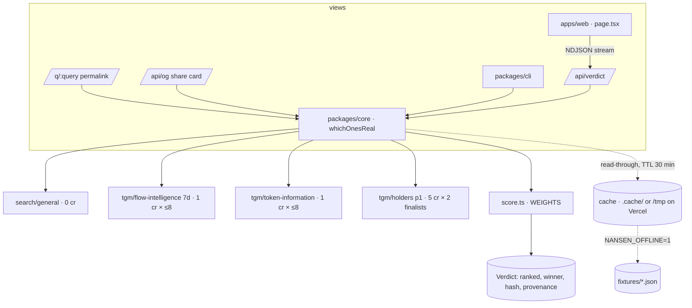

# Architecture — as shipped

One verdict function, three views. No database, no accounts, no LLM: deterministic arithmetic over Nansen fields.

## The pipeline (`packages/core/src/verdict.ts`)

1. **search** — `search/general {search_query, result_type:"token", limit:50}` → dedupe by chain+address → keep exact name/symbol matches (`sameName`) → cap 8. Chains flow-intelligence cannot score (perp venues like `hyperliquid`, `arc`) are shown greyed and never ranked.
2. **facts** (parallel per candidate, `facts.ts`) — `tgm/flow-intelligence {chain, token_address, timeframe:"7d"}` and `tgm/token-information {…, timeframe:"7d"}` via `Promise.allSettled`; each failure lands in `errors[]` on that candidate. token-information has a 4 s timeout and no retry so a hung secondary lookup degrades one card to "age unknown" instead of stalling the verdict.
3. **score** (`score.ts`) — pure function, every term a Nansen field, `WEIGHTS` in one object; `impostor` and `unchecked` flags; reasons as strings the UI shows verbatim.
4. **tiebreak** — the top-2 checked candidates get `tgm/holders {pagination:{page:1,per_page:20}}`; `recognisedHolders` counts rows with a wealth/activity `address_label`, excluding structural tags (`STRUCTURAL_TAG`).
5. **verdict** — rank (checked › unchecked › unscorable, then score), crown or abstain, warnings, provenance = the client's `Call[]` slice, `hash = sha256(decision)` where decision = query, filter, weights, ordered ids with scores, winner, impostor flags — never cost, timing, market cap or error text.
6. **progress** — `onProgress` emits `candidates` → `scored`×N → `verdict`; the web route streams these as NDJSON so cards reorder as facts land.

## Client (`client.ts`, `cache.ts`)

- `fetch` + `apikey` header, 10 rps token bucket, 6 s timeout, one retry on 429/5xx/timeout, per-call overrides.
- Every call — including failures and cache hits — is a `Call` with endpoint, body, credits (static table), ms, attempts, `responseHash = sha256(raw body)`, fields used.
- `CachedNansenClient` is read-through: hits are recorded at 0 credits with `cached: true`; `ttlMs: 0` bypasses reads (`--no-cache`); `NANSEN_OFFLINE=1` serves any age and throws on a miss.
- Fixtures (`fixtures.ts`) store the cache entries a verdict touched plus the verdict and the clock (`now`) it ran under, so `verify` replays a week later still computes the same `ageDays`.

## Web (`apps/web`)

Next.js 15 App Router, plain CSS (no component library), one client component. `/api/verdict?stream=1` → NDJSON; `/q/[query]` renders the verdict server-side with OG tags; `/api/og` draws the 1200×630 card with `next/og`. The key is server-side only; queries are validated (`/^[A-Za-z0-9 ._$-]{1,32}$/`) and the chain filter is an allowlist. Cache lives in `/tmp` per Vercel instance.

## Scripts

`spike` (candidates per ticker, 0 cr) · `probe` (raw facts table) · `seed` (record fixtures live) · `verify` (offline replay, exit 1 on any drift) · `bench` (p50/p95, credits) · `check` (submission readiness).

## Deviations from the plan (`../specs/architecture.md`)

- Tailwind → plain CSS: fewer moving parts for a 45-second recording; same palette.
- `commander` not used: the CLI is 40 lines of argv parsing.
- Web cache is disk in `/tmp` (per instance) rather than Vercel KV: no extra service to break on camera; a cold instance simply goes live.
- `tgm/indicators` risk badge (SHOULD) not shipped.
