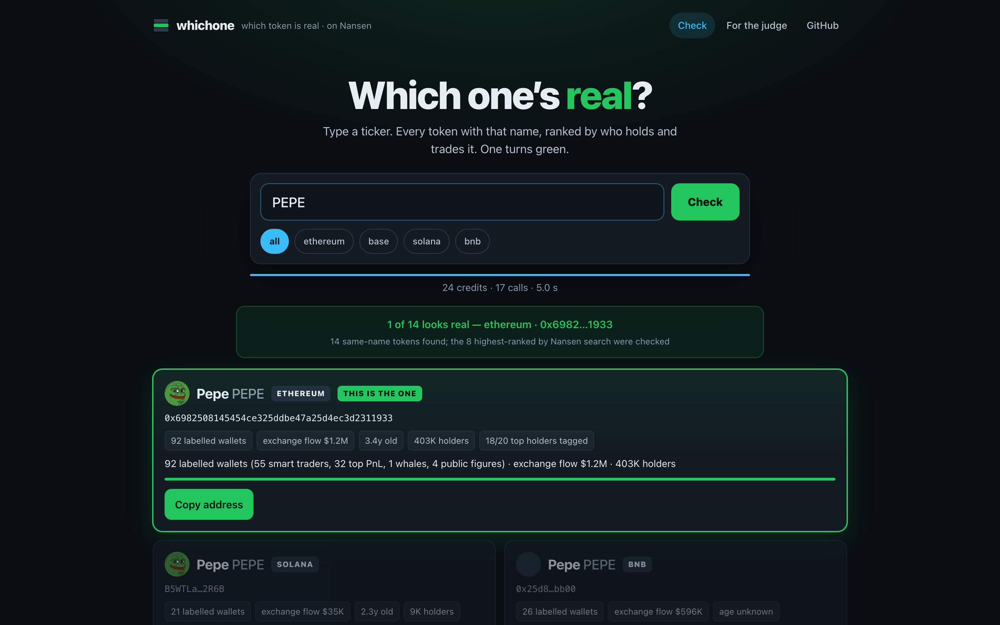
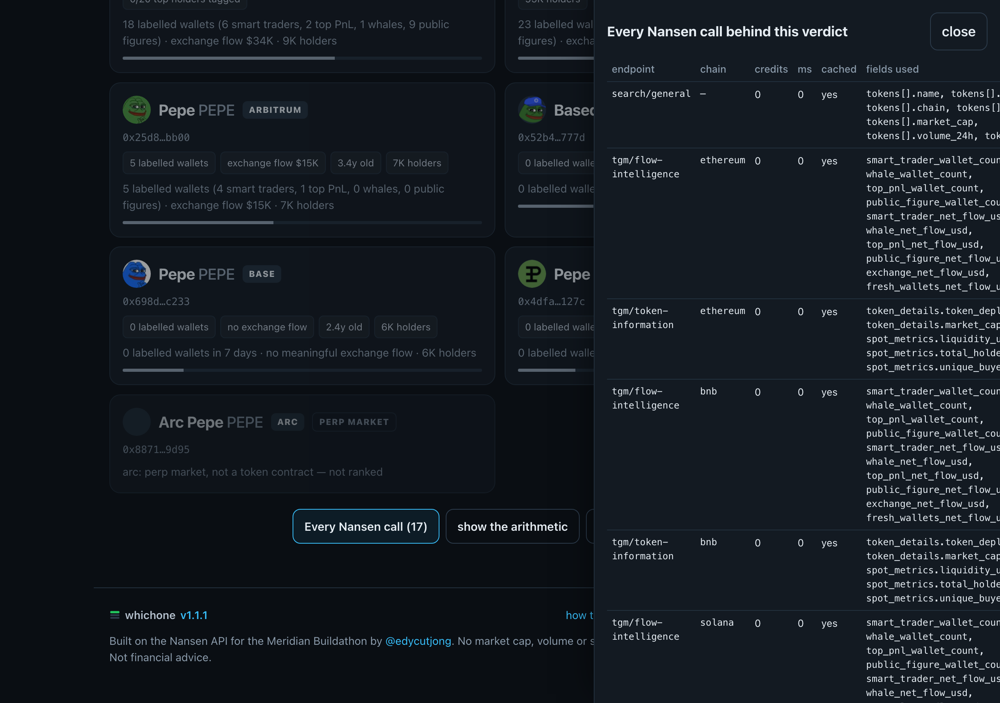

<div align="center">



# Which One's Real

**Type a ticker. Fourteen tokens share the name. Nansen labels decide which one is real.**

[Live demo](https://whichone-edycutjong.vercel.app) · [How the score works](docs/SCORING.md) · [Reproduce it](DEMO.md) · [Architecture](ARCHITECTURE.md) · [Nansen DX report](docs/DX-REPORT.md)

    

</div>

## The problem nobody had a tool for

Maya heard "buy PEPE", typed it into her wallet, and got fourteen tokens with the same name and the same frog. She bought the three-day-old one. Every safety scanner needs a contract address *first* — she didn't have one. Explorers show all fourteen as equally valid contracts. DEX search ranks by liquidity or volume, which is exactly what an impostor buys.

**Which One's Real** ranks same-name tokens by **who actually holds and trades them** — labelled Smart Money, whales, top-PnL and public-figure wallets, exchange flow, holder tags — and turns one card green. Market cap, volume and search rank are not in the score at all.

## What you see

| Ticker in | Cards appear pending, reorder as Nansen facts land | One turns green, impostors go red |
|---|---|---|
| `PEPE` | 14 same-name tokens across 7 chains; the 8 best-ranked by Nansen search are checked | `ethereum 0x6982…1933` — 91 labelled wallets, $2.1M exchange flow, 18/20 top holders tagged |
| `SHIB2` | 1 candidate, 3 years old, $36K market cap | **abstains**: "none of these looks real — nothing labelled has touched any of them" |
| `XQZPLM` | 0 results | abstains: "no token named XQZPLM on Nansen" |

Every verdict ships with a **provenance drawer**: every Nansen call, its credits, latency, whether it was cached, and the exact response fields that entered the score. The CLI prints the same table with `--explain`. The verdict hash on the share card covers the decision only, so a cached replay and a live run that reach the same answer hash identically.

<div align="center"></div>

## Run it in under 10 minutes

```bash
git clone https://github.com/edycutjong/whichone && cd whichone
npm install                                   # ~40 s
export NANSEN_API_KEY=nsn_...                 # https://app.nansen.ai/api — one env var, nothing else
npm run whichone -- PEPE                      # ≤ 26 credits, ~4 s cold, 0 credits and ~0 s on the second run
npm run whichone -- PEPE --explain            # every term of the score
npm run whichone -- PEPE --chain base --json  # chain filter, machine output
npm run verify                                # replays 12 recorded verdicts offline — no key, no network, 12/12
npm run dev                                   # http://localhost:3000
```

Measured on a clean clone from GitHub (macOS, Node 22, warm npm cache, 2026-09-16): clone 2 s · install 4 s · first live verdict 4 s · `verify` < 1 s · `next build` 8 s · tests 4 s — **22 s of machine time** plus pasting the API key.

## The score, in one screen

```
score = 3.0·ln(1+labelled_wallets)  + 0.6·max(0, log10|exchange_net_flow_usd|−3)
      + 0.6·log10(1+total_holders) + 0.4·log10(1+liquidity_usd)
      − 2.0·[age<7d] − 1.0·[age<30d] − 1.5·fresh_share·[labelled<3]
      + 0.8·ln(1+recognised_holders)                       # finalists only; pools/deployers/ENS names don't count
IMPOSTOR = 0 labelled ∧ exchange flow < $10K ∧ (age < 14d ∨ holders < 500)
ABSTAIN  = best < 2.0 ∨ (0 labelled ∧ recognised_holders < 3)
```

Worked with real numbers in [docs/SCORING.md](docs/SCORING.md). Weights live in one object (`packages/core/src/score.ts`) and are printed with every verdict.

## Nansen integration — the engine, not decoration

| Endpoint | Credits | Fields that enter the score | Decides |
|---|---|---|---|
| `search/general` (`result_type: token`) | 0 | `tokens[].name/symbol/chain/address` | the candidate set — every token named X across chains |
| `tgm/flow-intelligence` (7d) | 1 × ≤8 | `smart_trader/whale/top_pnl/public_figure_wallet_count`, `exchange_net_flow_usd`, `fresh_wallets_net_flow_usd` | the core signal: who is trading it |
| `tgm/token-information` | 1 × ≤8 | `token_deployment_date`, `total_holders`, `liquidity_usd` | age, breadth, depth; the impostor rule |
| `tgm/holders` (page 1, 20 rows) | 5 × 2 | `address_label`, `ownership_percentage` | the top-2 tiebreak: how many top holders Nansen tags |

≤ 26 credits per verdict, 0 on a cache hit. Cached calls are labelled and never counted. Failed calls are shown in the drawer, never hidden — a candidate whose lookups failed is marked "could not check" and is never crowned or called an impostor.

**Why only Nansen:** an RPC or explorer shows *transfers*; the decision needs *who*. Take Nansen out and you would need a multi-chain token index, a wallet-labelling graph and a holder indexer — and still could not answer "which one is real". There is deliberately no fallback ranking by market cap.

**Not used, on purpose:** `profiler/address/labels` (100 cr) and premium labels (150 cr) — a public tool has to stay under ~26 credits a query. `tgm/position-intelligence` is perp positioning only. Everything we learned the hard way is in [docs/DX-REPORT.md](docs/DX-REPORT.md).

## Honesty

- **Fixtures are replays, the default path is live.** `fixtures/*.json` hold 12 real verdicts recorded on 2026-09-16 with every raw Nansen response byte-for-byte. `npm run verify` replays them with `NANSEN_OFFLINE=1` and requires the same decision hash, the same ranking and zero network calls. The CLI and the web app never read them.
- **Numbers come from scripts.** [docs/BENCH.md](docs/BENCH.md) is the output of `npm run bench` (12 queries × 2 cold runs, live): cold p50 **3.6 s** / p95 **7.2 s**, warm p50 **3 ms**, mean **18.6 credits** per verdict. `USDC` (24 canonical issues) is the slow outlier at 15 s cold; Nansen times out on a few of its solana lookups, which the drawer shows.
- **57 tests** (`npm test`): the ranking function table-driven, the abstain/impostor/unchecked paths, hash stability, cache bypass, client retry and timeout accounting, fixture round-trip, the structural-tag rule, the holders tiebreak flip.
- **Known limits.** Label coverage is uneven across chains — a real token on a thinly-labelled chain can lose to a bridged copy on a busy one (the chain filter exists for that). Flow-intelligence is a 7-day window. `search/general` decides the candidate set: an impostor Nansen has not indexed cannot be warned about. `DOGE` crowns a Solana meme DOGE because native DOGE has no contract to compare against.

## Repo map

```
packages/core/   whichOnesReal() — search → facts → score → tiebreak → verdict (+ cache, fixtures)
packages/cli/    npm run whichone -- <ticker>
apps/web/        Next.js 15: streaming /api/verdict, /q/[query] permalink, /api/og share card
scripts/         spike · seed · verify · bench · check_submission_readiness
fixtures/        12 recorded verdicts (raw responses + verdict + clock)
docs/            SCORING.md · BENCH.md · DX-REPORT.md · screenshots/
```

Built for the [Nansen Meridian Buildathon](https://nansen.ai/campaigns/meridian-buildathon) by [@edycutjong](https://x.com/edycutjong). MIT.
