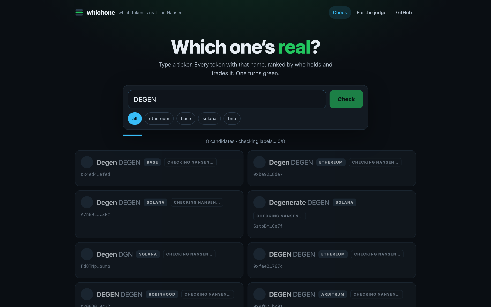
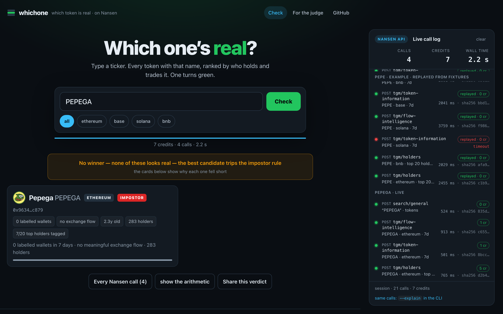
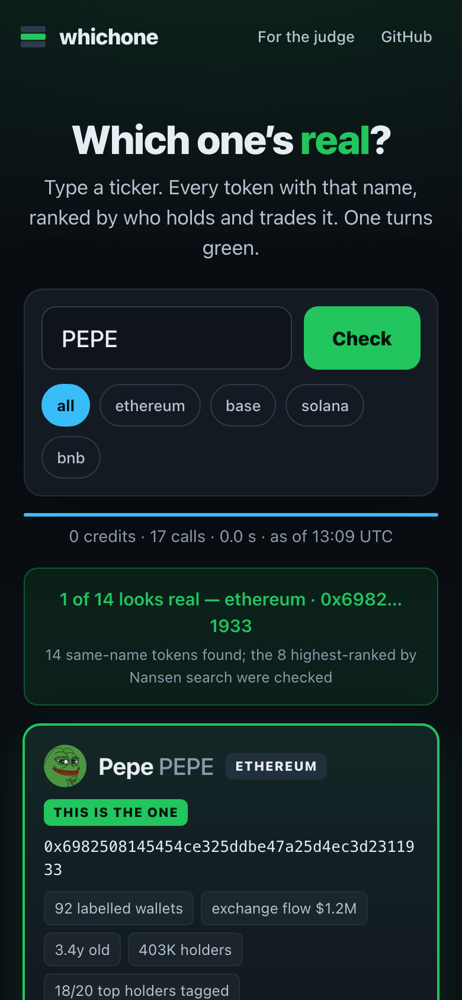
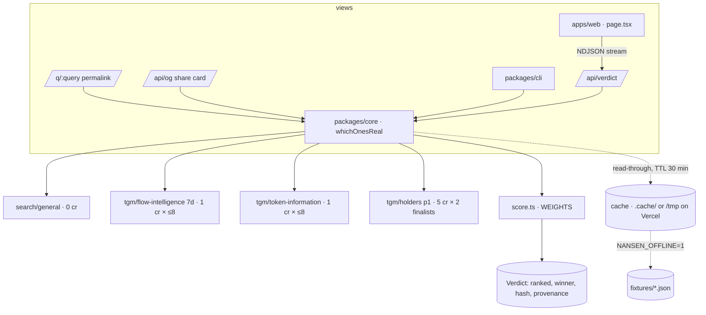

<div align="center">


<h1>Which One's Real 🟢</h1>
<p><em>Type a ticker. Fourteen tokens share the name — Nansen labels decide which one is real.</em></p>



<p>Every verdict is deterministic arithmetic over Nansen fields — no market cap, no volume, no search rank. <code>npm run verify</code> replays 12 recorded verdicts offline and reproduces every decision hash.</p>

<br/>

[](https://whichone.edycu.dev)
[](https://whichone.edycu.dev/judge)
[](https://nansen.ai/campaigns/meridian-buildathon)

<br/>


[](LICENSE)
[](https://github.com/edycutjong/whichone/actions/workflows/ci.yml)
[](https://github.com/edycutjong/whichone/actions/workflows/codeql.yml)
[](https://github.com/edycutjong/whichone/releases)

</div>

---

## 📸 See it in Action


| Ticker in | Cards appear pending, reorder as Nansen facts land | One turns green, impostors go red |
|---|---|---|
| `PEPE` | 14 same-name tokens across 7 chains; the 8 best-ranked by Nansen search are checked | `ethereum 0x6982…1933` — 92 labelled wallets, $1.2M exchange flow, 18/20 top holders tagged (live, 2026-09-17) |
| `SHIB2` | 1 candidate, 3 years old, $36K market cap | **abstains**: "none of these looks real — nothing labelled has touched any of them" |
| `XQZPLM` | 0 results | abstains: "no token named XQZPLM on Nansen" |

Every verdict ships with a **provenance drawer**: every Nansen call, its credits, latency, whether it was cached, and the exact response fields that entered the score. The CLI prints the same table with `--explain`. The verdict hash on the share card covers the decision only, so a cached replay and a live run that reach the same answer hash identically.

<div align="center"></div>

| Loading — `DEGEN`: 8 cards pending, progress strip filling | Abstain — `SHIB2`: no winner, the card says why | Mobile — `PEPE` verdict at 390 px |
|---|---|---|
|  |  |  |

## 💡 The Problem & Solution

### The Problem

Maya heard "buy PEPE", typed it into her wallet, and got fourteen tokens with the same name and the same frog. She bought the three-day-old one. Every safety scanner needs a contract address *first* — she didn't have one. Explorers show all fourteen as equally valid contracts. DEX search ranks by liquidity or volume, which is exactly what an impostor buys.

### The Solution

**Which One's Real** ranks same-name tokens by **who actually holds and trades them** — labelled Smart Money, whales, top-PnL and public-figure wallets, exchange flow, holder tags — and turns one card green. Market cap, volume and search rank are not in the score at all.

```
score = 3.0·ln(1+labelled_wallets)  + 0.6·max(0, log10|exchange_net_flow_usd|−3)
      + 0.6·log10(1+total_holders) + 0.4·log10(1+liquidity_usd)
      − 2.0·[age<7d] − 1.0·[age<30d] − 1.5·fresh_share·[labelled<3]
      + 0.8·ln(1+recognised_holders)                       # finalists only; pools/deployers/ENS names don't count
IMPOSTOR = 0 labelled ∧ exchange flow < $10K ∧ (age < 14d ∨ holders < 500)
ABSTAIN  = best < 2.0 ∨ (0 labelled ∧ recognised_holders < 3)
```

Worked with real numbers in [docs/SCORING.md](docs/SCORING.md). Weights live in one object (`packages/core/src/score.ts`) and are printed with every verdict.

## 🏗️ Architecture & Tech Stack

One verdict function, three views. No database, no accounts, no LLM.



| Layer | Choice | Why |
|---|---|---|
| Engine | TypeScript, `packages/core` — search → facts → score → tiebreak → verdict | one pure pipeline shared by CLI and web; `score()` is a pure function |
| Client | native `fetch`, `apikey` header, 10 rps bucket, 6 s timeout, 1 retry, sha256 of every response | every call — hit, miss or failure — is a `Call` in provenance |
| Web | Next.js 15 App Router, React 19, plain CSS | streaming `/api/verdict`, `/q/[query]` permalink, `/api/og` share card via `next/og` |
| CLI | `npm run whichone -- <ticker>` | same engine, `--explain` prints the arithmetic |
| Cache | disk, TTL 30 min (`.cache/` locally, `/tmp` on Vercel); `NANSEN_OFFLINE=1` replays fixtures | 0 credits on a hit, labelled as cached |
| Tests / CI | vitest + fast-check + Playwright; 7-stage GitHub Actions pipeline (gates → Vercel production deploy) | no Nansen key anywhere in CI |

Full detail: [ARCHITECTURE.md](ARCHITECTURE.md).

## 🏆 Nansen Integration

The engine, not decoration — every term in the score is a Nansen response field.

| Endpoint | Credits | Fields that enter the score | Decides |
|---|---|---|---|
| `search/general` (`result_type: token`) | 0 | `tokens[].name/symbol/chain/address` | the candidate set — every token named X across chains |
| `tgm/flow-intelligence` (7d) | 1 × ≤8 | `smart_trader/whale/top_pnl/public_figure_wallet_count`, `exchange_net_flow_usd`, `fresh_wallets_net_flow_usd` | the core signal: who is trading it |
| `tgm/token-information` | 1 × ≤8 | `token_deployment_date`, `total_holders`, `liquidity_usd` | age, breadth, depth; the impostor rule |
| `tgm/holders` (page 1, 20 rows) | 5 × 2 | `address_label`, `ownership_percentage` | the top-2 tiebreak: how many top holders Nansen tags |

≤ 26 credits per verdict, 0 on a cache hit. Cached calls are labelled and never counted. Failed calls are shown in the drawer, never hidden — a candidate whose lookups failed is marked "could not check" and is never crowned or called an impostor.

### Why only Nansen

An RPC or explorer shows *transfers*; the decision needs *who*. Take Nansen out and you would need a multi-chain token index, a wallet-labelling graph and a holder indexer — and still could not answer "which one is real". There is deliberately no fallback ranking by market cap.

**Not used, on purpose:** `profiler/address/labels` (100 cr) and premium labels (150 cr) — a public tool has to stay under ~26 credits a query. `tgm/position-intelligence` is perp positioning only. Everything we learned the hard way is in [docs/DX-REPORT.md](docs/DX-REPORT.md).

## 📊 Engineering Rigor

| Metric | Value | Source |
|---|---|---|
| Tests | **128 tests** (`npm test`) — regression tests named for the defect they pin | `packages/core/test/` |
| Property-based verification | **50,000 generated cases** (fast-check, 5 properties × 10,000) on the decision function: the crown rule, `rank()` as a total order, `score()` blind to every buyable field | `packages/core/test/property.test.ts` |
| Permission boundary | the server key never reaches a client; **10,000 generated malformed queries** rejected with zero network calls | `packages/core/test/boundary.test.ts`, [SECURITY.md](.github/SECURITY.md) |
| Spend guard | public route capped at 6 verdicts/min per address and 3,000 live credits/day; past the ceiling a recorded fixture replays at 0 credits, labelled, or the request gets an honest 503 | `apps/web/lib/guard.ts`, `packages/core/test/guard.test.ts` |
| E2E | 4 Playwright suites, desktop + Pixel 7, built app run **without** a key | `e2e/` |
| Fixtures | 12/12 verdicts reproduced offline, zero network, zero credits | `npm run verify`, `fixtures/*.json` |
| Cold latency | p50 **3.6 s** · p95 **7.2 s** (12 queries × 2 runs, live) | [docs/BENCH.md](docs/BENCH.md) |
| Warm latency | p50 **3 ms** | [docs/BENCH.md](docs/BENCH.md) |
| Credits per verdict | mean **18.6**, max 26 | [docs/BENCH.md](docs/BENCH.md) |
| Clean clone → first verdict | **22 s** | see Getting Started |

### Honesty

- **Fixtures are replays, the default path is live.** `fixtures/*.json` hold 12 real verdicts recorded on 2026-09-16 with every raw Nansen response byte-for-byte. `npm run verify` replays them with `NANSEN_OFFLINE=1` and requires the same decision hash, the same ranking and zero network calls. The CLI never reads them; the web app reads one only after the day's live credit ceiling is spent, and says so in the verdict (`degraded: true`, a warning line on the card).
- **Numbers come from scripts.** [docs/BENCH.md](docs/BENCH.md) is the output of `npm run bench`. `USDC` (24 canonical issues) is the slow outlier at 15 s cold; Nansen times out on a few of its solana lookups, which the drawer shows.
- **What the tests cover:** the ranking function table-driven, the abstain/impostor/unchecked paths, hash stability, cache bypass, client retry and timeout accounting, fixture round-trip, the structural-tag rule, the holders tiebreak flip, the address-pasted hint — plus three high-signal categories: **defect-named regression tests** (the test list reads as the changelog of real bugs found in live QA and code review), **property-based verification** of the crown rule / ranking / scorer over 50,000 generated cases, and a **permission-boundary suite** proving the key stays server-side and validation runs before any fetch.

### Honest limits (8)

1. Label coverage is uneven across chains — a real token on a thinly-labelled chain can lose to a bridged copy on a busy one; the chain filter exists for that.
2. Flow-intelligence is a 7-day window; a real but dormant token can look quiet.
3. `search/general` decides the candidate set: an impostor Nansen has not indexed cannot be warned about.
4. `DOGE` crowns a Solana meme DOGE because native DOGE has no contract to compare against.
5. The holders tiebreak counts wealth/activity tags ("Token Millionaire", "High Activity"), not exchange/fund entities — those are the premium tier and are not used.
6. A token with 0 labelled wallets can still be crowned when ≥ 3 top holders carry a wealth tag (`AI16Z`, `PEPE UNCHAINED` on 2026-09-16) — the card says "0 labelled wallets" so the weakness is visible.
7. Dead tokens were being crowned on a Uniswap-pool + deployer tag alone (`SHIB2`, found in live QA 2026-09-16) — fixed by excluding structural tags; kept as a regression test.
8. Independent code review (2026-09-16) found the web input truncated pasted addresses at 32 chars, a stream ending early left the spinner stuck, `/q/%25` threw on a double decode, and OG images were uncached (every link-preview crawler spent ≤ 26 credits) — all fixed the same day.

## 🚀 Getting Started

### Prerequisites

- Node 22 (20+ works)
- A Nansen API key from [app.nansen.ai/api](https://app.nansen.ai/api) — the only configuration

### Installation

```bash
git clone https://github.com/edycutjong/whichone && cd whichone
npm install                                   # ~40 s
export NANSEN_API_KEY=nsn_...                 # one env var, nothing else
npm run whichone -- PEPE                      # ≤ 26 credits, ~4 s cold, 0 credits and ~0 s on the second run
```

### Run it in under 10 minutes

```bash
npm run whichone -- PEPE --explain            # every term of the score
npm run whichone -- PEPE --chain base --json  # chain filter, machine output
npm run verify                                # replays 12 recorded verdicts offline — no key, no network, 12/12
npm run dev                                   # http://localhost:3000
```

Measured on a clean clone from GitHub (macOS, Node 22, warm npm cache, 2026-09-16): clone 2 s · install 4 s · first live verdict 4 s · `verify` < 1 s · `next build` 8 s · tests 4 s — **22 s of machine time** plus pasting the API key.

## 🧪 Testing & CI

**7-stage pipeline:** Quality → Security → Build → E2E → Performance → Deploy Gate → Production Deploy (prebuilt `vercel deploy` to whichone.edycu.dev, `main` only, after every gate) — no API key anywhere in CI; the one secret is `VERCEL_TOKEN`.

```bash
# ── Code Quality ────────────────────────────
npm run lint           # ESLint (flat config: TypeScript, React hooks, Next)
npm run format:check   # Prettier
npm run typecheck      # tsc, strict
npm test               # 128 vitest tests (unit + property + boundary)
npm run test:coverage  # + v8 coverage report
npm run verify         # 12 fixtures, offline, exit 1 on any hash/ranking drift
npm run ci             # audit · format · lint · typecheck · coverage · verify · check

# ── Advanced Testing ────────────────────────
npm run e2e            # Playwright: home, verdict flow, responsive, /judge — built app, no key
npm run e2e:ui         # Playwright interactive mode
npm run lighthouse     # Lighthouse CI (a11y ≥ 0.9 hard gate; perf/SEO/best-practices advisory)

# ── Live (spends credits) ───────────────────
npm run bench -- --runs 2 > docs/BENCH.md   # ~450 credits
npm run check          # submission readiness: README claims vs tree, kitchen/secret scan, links
```

| Layer | Tool | Status |
|---|---|---|
| Code Quality | ESLint + Prettier + TypeScript strict | ✅ |
| Unit Testing | vitest, 128 tests, v8 coverage | ✅ |
| High-signal tests | defect-named regressions · 50,000 property cases (fast-check) · permission boundary | ✅ |
| E2E Testing | Playwright, 4 suites × 2 devices, no key | ✅ |
| Security (SAST) | CodeQL (javascript-typescript) | ✅ |
| Security (SCA) | Dependabot (4 manifests + actions, grouped, no majors) + npm audit + license-checker | ✅ |
| Secret Scanning | gitleaks (full history) + TruffleHog (verified only) + `npm run check` history grep | ✅ |
| Performance | Lighthouse CI + bundle budget (2 MB) | ✅ |
| Releases | `release.yml` — semantic tags from conventional commits | ✅ |
| Judge surface | [/judge](https://whichone.edycu.dev/judge) · [JUDGE.md](JUDGE.md) — no auth, static | ✅ |

## 📁 Project Structure

```
packages/core/   whichOnesReal() — search → facts → score → tiebreak → verdict (+ cache, fixtures)
packages/cli/    npm run whichone -- <ticker>
apps/web/        Next.js 15: streaming /api/verdict, /q/[query] permalink, /api/og share card
e2e/             Playwright: demo-mode · verdict-flow · responsive · judge-route
scripts/         spike · seed · verify · bench · check_submission_readiness
fixtures/        12 recorded verdicts (raw responses + verdict + clock)
docs/            SCORING.md · BENCH.md · DX-REPORT.md · screenshots/
JUDGE.md         the /judge page: claim · 30-second path · receipts · reproduce · limitations
```

## 📽️ Demo Materials

- Live: [whichone.edycu.dev](https://whichone.edycu.dev)
- For judges: [whichone.edycu.dev/judge](https://whichone.edycu.dev/judge) (mirrored in [JUDGE.md](JUDGE.md))
- Reproduce the recording step by step: [DEMO.md](DEMO.md)

## 📄 License

MIT — built for the [Nansen Meridian Buildathon](https://nansen.ai/campaigns/meridian-buildathon) by [@edycutjong](https://x.com/edycutjong).
